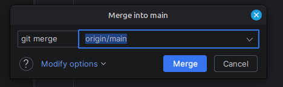

# Tarea: Actualización con dos desarrolladores

## Batalla Naval de Commits

## Autores

- Anxo Vázquez

- Antón Rodríguez

# Paso 1

En este paso se crea el repositorio y se añaden los archivos, después se clonan los reposiotios.

### ¿Qué línea de comando usaría User 2 para verificar que la conexión remota (origin) está configurada y apuntando al repositorio de User 1?

```
git status
```

# Paso 2

El usuario1 edita barco.py y realiza un commit.
Después el usuario2 edita tablero.py y realiza un commit local.
El usuario dos realiza un `fetch` y hace un `push` de su commit local.



### En el historial de GitHub, después de la subida de User 2, ¿el historial se ve como una línea recta o como una bifurcación con un punto de unión?

Línea Recta

# Paso 3

Después de las modificaciones el usuario 1 hace `git pull --rebase` y hace un `push` de su commit.

### ¿Se ve más o menos legible que el del Paso 2?. ¿Tenéis en local los dos User el mismo código?

Si
